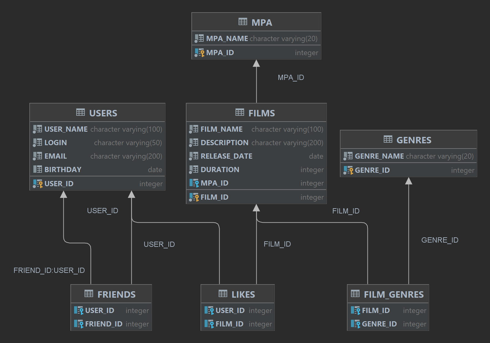

# java-filmorate

### Диаграма зависимости таблиц:

### Описание:
Приложение для поиска и оценки фильмов.

### Примеры запросов: 
* Запрос на выдачу всех фильмов:

SELECT FILM_ID, FILM_NAME, DESCRIPTION, RELEASE_DATE, DURATION,F.MPA_ID, M.MPA_NAME
FROM FILMS F JOIN MPA M ON F.MPA_ID = M.MPA_ID;
 
* Создание пользователя:

INSERT INTO USERS (LOGIN, USER_NAME, EMAIL, BIRTHDAY)
VALUES (?, ?, ?, ?); 

* Запрос пользователя по id:

SELECT * 
FROM USERS 
WHERE USER_ID = ?;

* Запрос на выдачу популярных фильмов:

SELECT F.FILM_ID, FILM_NAME, DESCRIPTION, RELEASE_DATE, DURATION, M.MPA_ID, M.MPA_NAME
FROM FILMS F JOIN MPA M ON M.MPA_ID = F.MPA_ID 
LEFT JOIN LIKES AS L ON F.FILM_ID = L.FILM_ID 
GROUP BY F.FILM_ID ORDER BY COUNT(L.USER_ID) DESC LIMIT 10;
